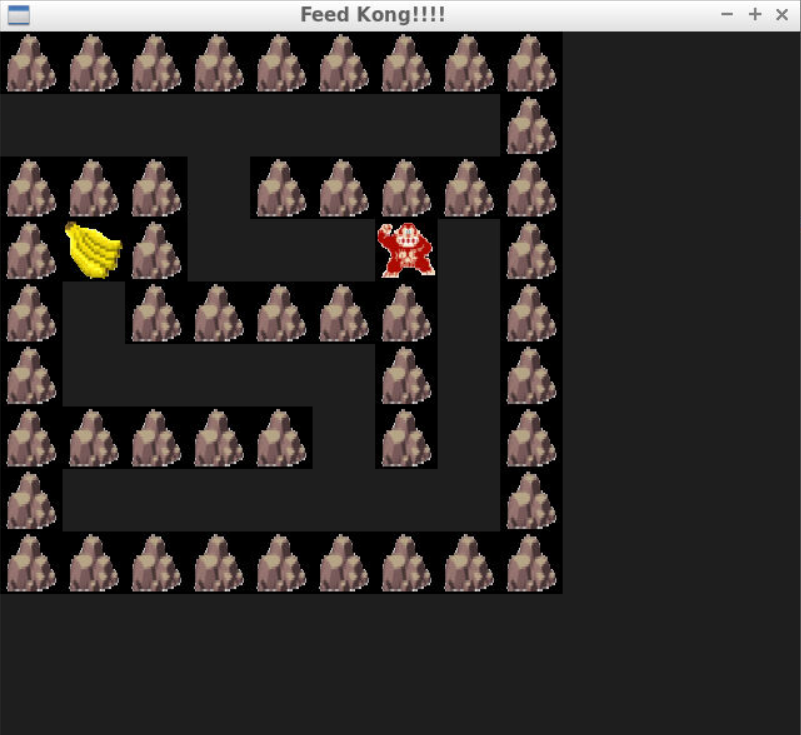

# Kong_Maze
This is a final project in the course of Cpp_Nano_Project provided by Udacity.
A simple Game is developed in Cpp with SDL2 Module.

## CPPND: Capstone Kong_Maze Game 

## Dependencies for Running Locally
* cmake >= 3.7
  * All OSes: [click here for installation instructions](https://cmake.org/install/)
* make >= 4.1 (Linux, Mac), 3.81 (Windows)
  * Linux: make is installed by default on most Linux distros
  * Mac: [install Xcode command line tools to get make](https://developer.apple.com/xcode/features/)
  * Windows: [Click here for installation instructions](http://gnuwin32.sourceforge.net/packages/make.htm)
* SDL2 >= 2.0
  * All installation instructions can be found [here](https://wiki.libsdl.org/Installation)
  >Note that for Linux, an `apt` or `apt-get` installation is preferred to building from source. 
* gcc/g++ >= 5.4
  * Linux: gcc / g++ is installed by default on most Linux distros
  * Mac: same deal as make - [install Xcode command line tools](https://developer.apple.com/xcode/features/)
  * Windows: recommend using [MinGW](http://www.mingw.org/)

## Basic Build Instructions

1. Clone this repo.
2. Make a build directory in the top level directory: `mkdir build && cd build`
3. Compile: `cmake .. && make` 
4. Run it: `./Kong_Maze`.

## Code Structure
The game loop has three Main components: Renderer, Controller, and Game.
- Game:
  This Game's Engine. It handles the game loop and store objects( Banana, Kong, Maze_map) used in this game.
- Renderer:
  Since in this project, I rendered lots of images in the program, here I created an Texture vector to store textures copy from surface. In this way these image will be loaded on GPU Memory which speed up the time for rendering. The delete function of renderer ensure that those memory are freed safely. 
- Controller:
  This handle every inputs from users, including Collision detection, Move Kong, Goal Reached, and End game selection.
- Entity:
  This class is designed as a basic class of every items in the game (banana,kong). It includes the function of coordinate of object, and also the getter and setter.
- MovableEntity:
  It is derived from Entity class. This includes how the movable object handles moving events.
- Kong:
  Dervied from MovableEntity class. It also owns the memvers of reset opsition and reset function for Restarting Games.
- Banana:
  Derived from Entity class. 
## Rubic Completed
### ReadME
- A README with instructions is included with the project
- The README indicates which project is chosen.
- The README includes information about each rubric point addressed.

### Compiling and Testing
- The submission must compile and run.

### Loops, Functions, I/O
- The project demonstrates an understanding of C++ functions and control structures.
- The project reads data from a file and process the data, or the program writes data to a file.
- The project accepts user input and processes the input.

### Object Oriented Programming
- The project uses Object Oriented Programming techniques.
- Classes use appropriate access specifiers for class members.
- Class constructors utilize member initialization lists.
- Classes abstract implementation details from their interfaces.
- Classes encapsulate behavior.
- Classes follow an appropriate inheritance hierarchy.
- Overloaded functions allow the same function to operate on different parameters.
  
## CC Attribution-ShareAlike 4.0 International

Shield: [![CC BY-SA 4.0][cc-by-sa-shield]][cc-by-sa]

This work is licensed under a
[Creative Commons Attribution-ShareAlike 4.0 International License][cc-by-sa].

[![CC BY-SA 4.0][cc-by-sa-image]][cc-by-sa]

[cc-by-sa]: http://creativecommons.org/licenses/by-sa/4.0/
[cc-by-sa-image]: https://licensebuttons.net/l/by-sa/4.0/88x31.png
[cc-by-sa-shield]: https://img.shields.io/badge/License-CC%20BY--SA%204.0-lightgrey.svg
